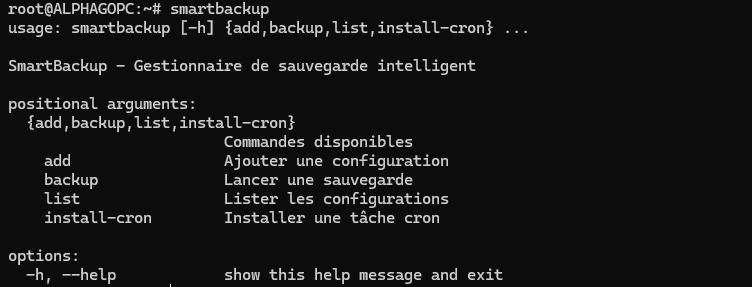

# SmartBackup 🚀

Un gestionnaire de sauvegarde intelligent et automatisé pour Linux avec support incrémentiel, compression et planification.



## ✨ Fonctionnalités

- **🔄 Sauvegarde incrémentielle** : Sauvegarde uniquement les fichiers modifiés
- **📦 Compression intelligente** : Réduit l'espace disque avec tar.gz
- **⏰ Planification flexible** : Intégration native avec cron
- **🎯 Interface intuitive** : Ligne de commande simple et claire
- **📊 Logs détaillés** : Suivi complet des opérations
- **🗑️ Nettoyage automatique** : Suppression des anciennes sauvegardes
- **🚫 Filtres d'exclusion** : Possibilité d'exclure certains fichiers/dossiers

## 🚀 Installation rapide

### Méthode 1 : Installation système
```bash
# Télécharger le script
wget https://raw.githubusercontent.com/votre-username/SmartBackup/main/smartbackup.py

# Rendre exécutable et installer
chmod +x smartbackup.py
sudo cp smartbackup.py /usr/local/bin/smartbackup
```

### Méthode 2 : Installation locale
```bash
# Cloner le repository
git clone https://github.com/votre-username/SmartBackup.git
cd SmartBackup

# Créer un alias dans votre .bashrc
echo "alias smartbackup='python3 $(pwd)/smartbackup.py'" >> ~/.bashrc
source ~/.bashrc
```

## 📖 Guide d'utilisation

### Configuration de base
```bash
# Ajouter une nouvelle configuration de sauvegarde
smartbackup add ma_sauvegarde \
  /home/user/Documents /home/user/Photos \
  --dest /mnt/backup \
  --schedule "0 2 * * *"
```

### Lancement manuel
```bash
# Exécuter une sauvegarde
smartbackup backup ma_sauvegarde
```

### Automatisation
```bash
# Installer la tâche cron automatiquement
smartbackup install-cron ma_sauvegarde

# Lister toutes les configurations
smartbackup list
```

## ⚙️ Options avancées

### Exclusion de fichiers
```bash
smartbackup add projet_dev \
  /home/user/dev \
  --dest /backup \
  --exclude ".git" "node_modules" "*.tmp" "__pycache__"
```

### Configuration personnalisée
```bash
smartbackup add sauvegarde_complete \
  /home/user \
  --dest /backup/complete \
  --schedule "0 1 * * 0" \
  --max-backups 5 \
  --no-compression
```

## 📁 Structure des sauvegardes

```
/destination/
├── config_name_20240904_140523/     # Sauvegarde non compressée
└── config_name_20240904_140523.tar.gz  # Sauvegarde compressée
```

## 🔧 Planification cron

| Format | Description | Exemple |
|--------|-------------|---------|
| `0 2 * * *` | Tous les jours à 2h | Sauvegarde nocturne |
| `0 */6 * * *` | Toutes les 6h | Sauvegarde fréquente |
| `0 1 * * 0` | Dimanche à 1h | Sauvegarde hebdomadaire |
| `0 0 1 * *` | 1er du mois à minuit | Sauvegarde mensuelle |

## 📊 Logs et monitoring

Les logs sont automatiquement sauvegardés dans :
```
~/.smartbackup/logs/smartbackup_YYYYMMDD.log
```

## 🛠️ Dépannage

### Problèmes courants

**Erreur de permissions :**
```bash
sudo chown -R $USER:$USER ~/.smartbackup
```

**Destination inaccessible :**
```bash
# Vérifier l'accès en écriture
touch /destination/test && rm /destination/test
```

**Problème cron :**
```bash
# Vérifier les tâches cron
crontab -l | grep smartbackup
```

## 🤝 Contribution

Les contributions sont les bienvenues ! 

1. Fork le projet
2. Créez une branche feature (`git checkout -b feature/amelioration`)
3. Commitez vos changes (`git commit -am 'Ajout nouvelle fonctionnalité'`)
4. Push vers la branche (`git push origin feature/amelioration`)
5. Ouvrez une Pull Request

## 📋 TODO / Roadmap

- [ ] Interface web optionnelle
- [ ] Support des destinations réseau (SSH, FTP)
- [ ] Chiffrement des sauvegardes
- [ ] Interface graphique GTK
- [ ] Support des bases de données
- [ ] Notifications par email
- [ ] Métriques de performance

## 📄 Licence

Ce projet est sous licence MIT. Voir le fichier [LICENSE](LICENSE) pour plus de détails.

## 👤 Auteur

**AlphaGo**
- GitHub: [@alphagoones](https://github.com/alphagoones)

## ⭐ Support

Si ce projet vous a été utile, n'hésitez pas à lui donner une étoile ! ⭐

## 📞 Support et Questions

- Ouvrir une [issue](https://github.com/alphagoones/SmartBackup/issues) pour les bugs
- Consulter la [documentation](docs/) pour plus de détails
- Voir les [exemples](examples/) pour des cas d'usage avancés
